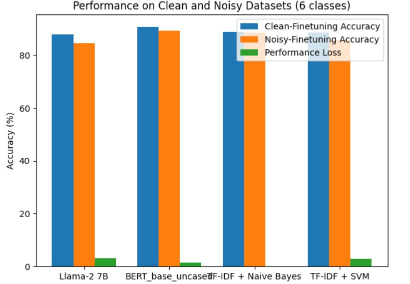
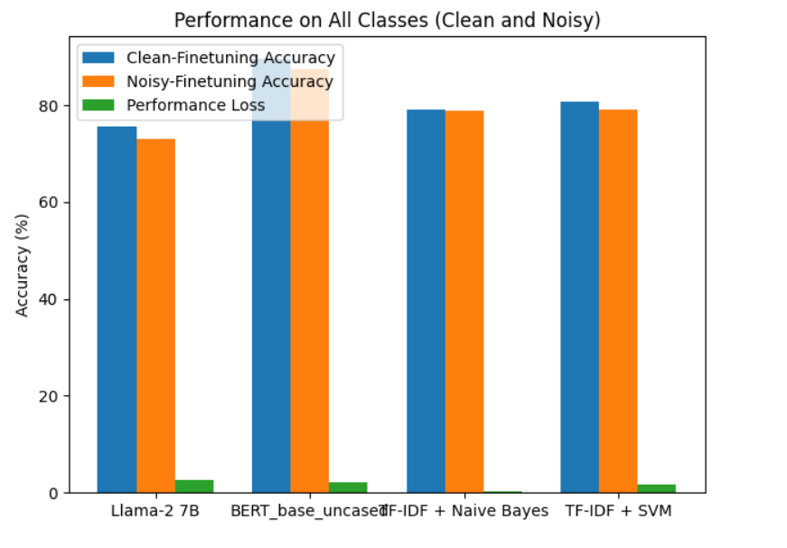
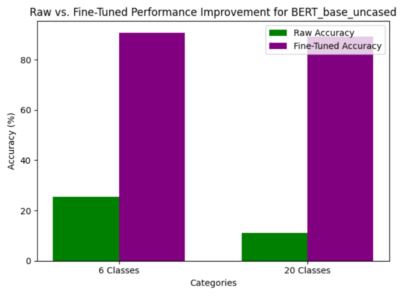
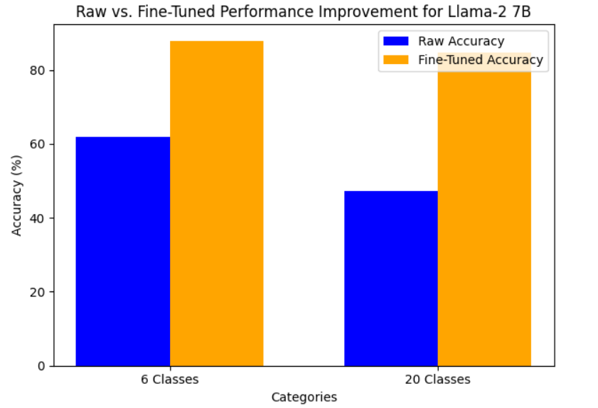
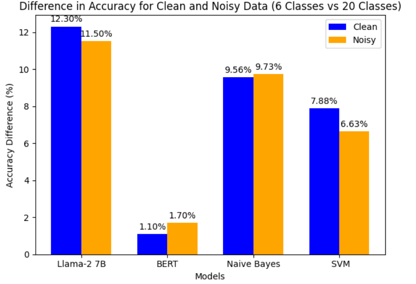

Why you should not use LLM's for text classification.. Or should you?
======================================================================

Welcome to my project where I dive into the world of text classification, comparing traditional methods like SVMs and Naive Bayes with large language models (LLMs) like Llama-2 7B and BERT_base_uncased . Spoiler: Bigger isn't always better!

Introduction
------------

Large language models are the new big thing in NLP. They've shown amazing capabilities in generating human-like text, but when it comes to tasks that need deterministic outcomes, like text classification, the story gets a bit more complicated.

Models Evaluated
----------------

-   **Llama-2 7B**
-   **BERT_base_uncased**
-   **TF-IDF with Naive Bayes**
-   **TF-IDF with SVM**

Evaluation Metrics
------------------

I evaluated these models on their performance with clean and noisy datasets. The primary metric was accuracy.

### Performance on Clean and Noisy Datasets (6 classes)

| Model | Clean-Finetuning Accuracy | Noisy-Finetuning Accuracy | Performance Loss |
| --- | --- | --- | --- |
| Llama-2 7B | 87.9% | 84.6% | 3.2% |
| BERT_base_uncased | 90.8% | 89.3% | 1.5% |
| TF-IDF with Naive Bayes | 88.71% | 88.58% | 0.13% |
| TF-IDF with SVM | 88.58% | 85.75% | 2.83% |

### Performance on All Classes (Clean and Noisy)

| Model | Clean-Finetuning Accuracy | Noisy-Finetuning Accuracy | Performance Loss |
| --- | --- | --- | --- |
| Llama-2 7B | 75.6% | 73.1% | 2.5% |
| BERT_base_uncased | 89.7% | 87.6% | 2.1% |
| TF-IDF with Naive Bayes | 79.15% | 78.85% | 0.3% |
| TF-IDF with SVM | 80.7% | 79.12% | 1.58% |

### Raw vs Fine-Tuned Performance Improvement

| Model | Raw Accuracy (6 Classes) | Fine-Tuned Accuracy (6 Classes) | Raw Accuracy (20 Classes) | Fine-Tuned Accuracy (20 Classes) |
| --- | --- | --- | --- | --- |
| Llama-2 7B | 62% | 87.9% | 47.2% | 84.6% |
| BERT_base_uncased | 25.6% | 90.8% | 11% | 89.3% |

    
    

### Performance degradation with increase in classes
This image shows the difference in accuracy with change in categories

Key Findings
------------

1.  **LLMs vs Traditional Methods:**

    -   Traditional methods like SVMs and Naive Bayes are still highly competitive with modern LLMs like BERT and Llama-2 7B.
    -   While Llama-2 7B shows weaker performance, Llama-2 13B and larger models are expected to perform better. However, the gain might not justify the computational cost.
2.  **Training Data Related:**
 
    -   LLM's are very data efficient. They tend to reach near peak performance from a very small part of the dataset. In our case we saw Llama-2 came close to peak after training 40 % of the data and BERT at 60 %.
    -   But it's not all good, LLM's being able to adjust very well with smaller dataset often makes them overfit to instances, making them more prone to performance loss when training with noisy dataset, which is clearly seen in our results.
    -   LLM's are still widely used and preferred for tasks like sentiment analysis, and yes LLM's are excellent at that, but the performance degrade with the increase of classification categories is very high.
4.  **Raw vs Fine-Tuned Performance:**

    -   With increasing size of the LLMs, the benifit of fine-tuning decreases while the raw classification accuracy increases.
    -   Larger models have complex and deep architectures with many layers, which makes them good for task generation. They excel in non-deterministic tasks and begin to perform worse at deterministic tasks like text classification. It is important to note that the finetuned models also lost a small chunk of their accuracy to sentence creation instead of direct answer, unrelated extra text and un-necessary explainations, for the sake of this experiment we only accepted the label text or the label as a valid output.

Conclusion
----------

* Well the big question is, should you use LLM's for text classification? And I think it depends, if its a simpler classification of 2-3 classes , then sure LLM's like llama are excellect and perform SOTA levels. But for 10+ classes, no. Very large LLM's can equal the quality and performance of traditional methods, but your better off just sticking to them for now.
* Saying that, I would like to point out that models like BERT, Roberta-base etc, draw a very fine line where they can still outperform most models for tasks like these without much degradation with increase in categories.
* The analysis reveals that while large LLMs have potential, traditional methods still hold their ground, especially when considering computational efficiency. By the time LLMs outperform SOTA methods, they become so large that it's impractical to use them for everyday tasks. Furthermore, the difference between pre-trained and fine-tuned models becomes negligible, making pre-trained models sufficient for many applications.

Note
-----

-   A small chunk of the accuracy loss in larger LLMs can be attributed to additional random text generation and scenario descriptions rather than strict classification.
-   Experimentation with a text classifier head model for Llama-2 7B showed underperformance compared to the normal text generation format. This just proves our results further than LLM's having such complex structure makes it even less accurate for classification models. Its kind of a **overkill** situation for simpler tasks like text classification.
